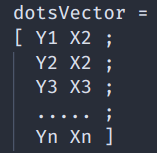
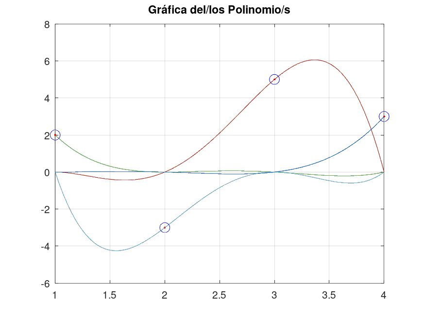
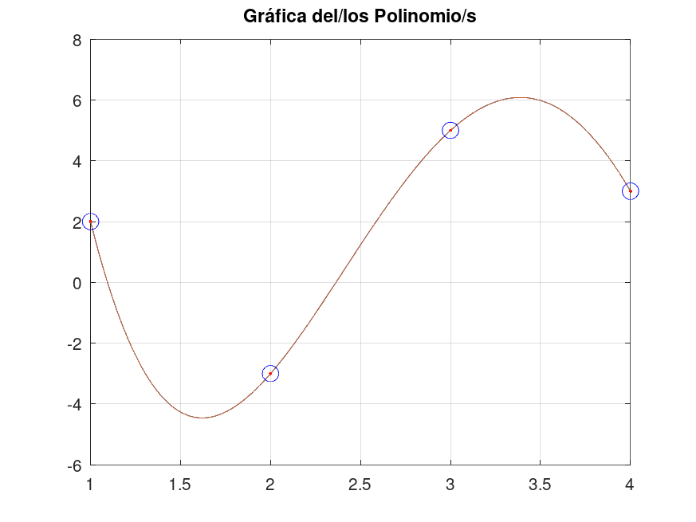

# ¿ COMO USAR INTERPOLACIÓN ?
el algoritmo que implemente es uno que interpola y grafica "n" puntos. Pero necesita un formato especial.
necesita un vecor de la siguiente forma:

Recuerden que tiene que ser funcion, no superponer las coordenadas x

dejo aca una funcion de ejemplo y el resultado esperado

## Ejemplo

Puntos usados: 
dotsVector = [ 2 1 ; -3 2 ; 5 3 ; 3 4 ];

**Polinomios de Lagrange:**

**Interpolacion final:**

